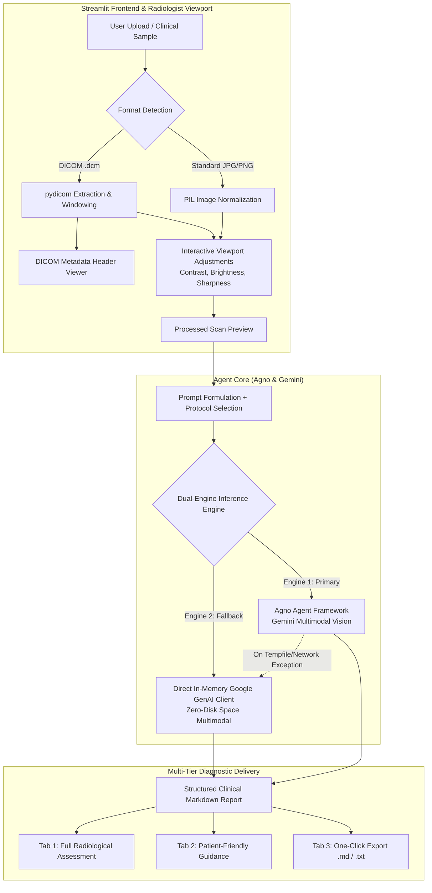

# 🩻 Autonomous Medical Imaging Diagnosis Agent

[](https://www.python.org/)
[](https://streamlit.io/)
[](https://agno.com/)
[](https://aistudio.google.com/)
[](https://pydicom.github.io/)
[](LICENSE)

> **An advanced, AI-powered radiological diagnostic assistant built with the Agno Agent Framework and Google Gemini multimodal models.** The agent analyzes complex medical scans (X-rays, MRIs, CT scans, Ultrasounds, and native DICOM files), producing structured clinical diagnostic reports, patient-accessible explanations, and evidence-based medical literature benchmarks.

---

## 📑 Table of Contents

- [Overview](#-overview)
- [System Architecture](#-system-architecture)
- [Core Features](#-core-features)
- [Supported Modalities & Formats](#-supported-modalities--formats)
- [Radiological Evaluation Pipeline](#-radiological-evaluation-pipeline)
- [Diagnostic Protocols](#-diagnostic-protocols)
- [Supported Gemini Models](#-supported-gemini-models)
- [Project Directory Structure](#-project-directory-structure)
- [Installation & Setup](#-installation--setup)
- [Running the Application](#-running-the-application)
- [Step-by-Step Usage Guide](#-step-by-step-usage-guide)
- [Pushing to GitHub](#-pushing-to-github)
- [Clinical Disclaimer & Safety](#-clinical-disclaimer--safety)

---

## 🩺 Overview

Medical imaging interpretation requires deep domain expertise, rigorous attention to subtle anatomical patterns, and systematic evaluation of organ compartments. The **Medical Imaging Diagnosis Agent** serves as an intelligent radiologist companion designed to:
- Accelerate clinical triage and preliminary scan assessment.
- Standardize radiological reporting according to formal clinical frameworks.
- Bridge the communication gap between complex radiological findings and patient comprehension.
- Provide native DICOM parsing, pixel normalization, and interactive windowing (contrast, brightness, edge sharpness) directly in the browser.

---

## 🏛️ System Architecture



---

## ✨ Core Features

### 1. Multi-Format Medical Ingestion & DICOM Support
- Direct ingestion of standard formats (**PNG**, **JPG**, **JPEG**).
- Native parsing of **DICOM (`.dcm`)** files via `pydicom`.
- Automatic pixel array extraction, min-max normalization, and 8-bit dynamic range conversion.
- Inspection of embedded DICOM header tags: *Modality, Patient ID (de-identified), Study Date, Body Part Examined, and Photometric Interpretation*.

### 2. Interactive Radiologist Viewport Controls
- **Contrast Windowing** ($0.5\times$ to $2.5\times$): Enhance soft tissue gradients or delineate dense bone structures.
- **Brightness Tuning** ($0.5\times$ to $2.0\times$): Illuminate underexposed regions or reduce glare in overexposed scans.
- **Edge Sharpness Filter** ($0.5\times$ to $2.5\times$): Highlight fine structural margins, fracture lines, and subtle interstitial opacities.

### 3. Preloaded Clinical Diagnostic Samples
- Immediately evaluate the system without needing local medical files:
  - **Chest X-Ray (PA View - Thoracic Evaluation)**
  - **Brain MRI (Axial T2-Weighted Neuroimaging)**

### 4. Resilient Dual-Engine Inference Pipeline
- **Primary Engine**: High-level agent orchestration using the **Agno** framework with vision toolsets and optional web search grounding.
- **Resilient Fallback Engine**: If disk space limits temporary file creation or network issues arise, the system instantly engages a zero-disk in-memory **Google GenAI Client (`google-genai`)** for 100% reliable execution.

### 5. Multi-Tab Report Delivery & Export
- **Tab 1 — Full Radiological Report**: In-depth formal documentation formatted in clean Markdown.
- **Tab 2 — Patient-Friendly Guidance**: Jargon-free explanation written at a 6th-to-8th grade reading level with visual analogies and questions for doctors.
- **Tab 3 — Clinical Report Export**: Instant one-click download in **Markdown (`.md`)** or **Plain Text (`.txt`)**.

---

## 🔬 Supported Modalities & Formats

| Modality | Common Projections / Sequences | Key Evaluated Structures |
| :--- | :--- | :--- |
| **Chest Radiography (X-Ray)** | PA, AP, Lateral, Decubitus | Lung fields, cardiomediastinal contour, costophrenic angles, osseous cage |
| **Neuroimaging (Brain MRI)** | T1-weighted, T2-weighted, FLAIR, DWI | Ventricular symmetry, sulci, midline shift, white/gray matter differentiation |
| **Computed Tomography (CT)** | Axial, Coronal, Sagittal reconstructions | Hounsfield densities, lesions, bone windows, soft tissue organ pathology |
| **Musculoskeletal Radiographs** | AP, Oblique, Lateral views | Cortical integrity, joint spacing, trabecular pattern, periosteal reaction |
| **Ultrasound (Sonography)** | B-mode acoustic imaging | Echogenicity, fluid collections, organ margins, cystic vs solid differentiation |

---

## 📋 Radiological Evaluation Pipeline

The agent structures every analysis using a standardized 5-tier radiological framework:

```
┌────────────────────────────────────────────────────────┐
│ 1. IMAGING MODALITY & TECHNICAL EVALUATION            │
│    - Modality identification & plane/projection        │
│    - Exposure quality, inspiratory effort, artifacts   │
├────────────────────────────────────────────────────────┤
│ 2. SYSTEMATIC KEY FINDINGS                            │
│    - Anatomical compartment-by-compartment review      │
│    - Lesion morphology, margins, attenuation/density   │
│    - Standard radiological measurements & indices      │
│    - Severity classification: Normal -> Critical       │
├────────────────────────────────────────────────────────┤
│ 3. DIAGNOSTIC IMPRESSION & DIFFERENTIAL DIAGNOSIS     │
│    - Primary clinical diagnosis + Confidence Score (%) │
│    - Ranked differential diagnoses with justifications │
│    - Acute red-flag alerts (e.g. midline shift, PTX)   │
├────────────────────────────────────────────────────────┤
│ 4. PATIENT-FRIENDLY SUMMARY                           │
│    - Accessible visual analogies (no intimidating terms│
│    - Direct answers: "What does this mean for me?"    │
│    - Actionable questions for physician consults       │
├────────────────────────────────────────────────────────┤
│ 5. RESEARCH CONTEXT & CLINICAL PROTOCOLS              │
│    - Evidence-based criteria (ACR, WHO, Fleischner)    │
│    - Benchmark diagnostic workup recommendations       │
└────────────────────────────────────────────────────────┘
```

---

## 🎯 Diagnostic Protocols

Tailor the agent's reasoning focus via the sidebar selector:

1. **Standard Comprehensive Radiology**: Full-spectrum, systematic organ survey covering all visible structures.
2. **Emergency / Acute Triage**: Rapid priority detection of life-threatening findings (e.g., tension pneumothorax, intracranial hemorrhage, acute aortic syndrome).
3. **Oncological / Lesion Screening**: High-specificity margin inspection, density mapping, lymphadenopathy assessment, and lesion dimension tracking.
4. **Musculoskeletal & Orthopedic**: Focus on cortical continuity, alignment, fracture line detection, joint congruence, and degenerative osteophytes.
5. **Patient-Centered Clarity**: Emphasizes accessible summaries and actionable next steps while maintaining technical completeness.

---

## 🤖 Supported Gemini Models

| Model ID | Clinical Suitability | Key Strengths |
| :--- | :--- | :--- |
| **`gemini-3.6-flash`** <br>*(Recommended & Default)* | Routine & emergency imaging interpretation | State-of-the-art vision reasoning, fast multimodal inference, high diagnostic accuracy. |
| **`gemini-2.5-flash`** | High-throughput batch triage | Ultra-fast token generation, low latency, lightweight footprint. |
| **`gemini-3.7-flash`** | Complex multislice comparative scans | Next-generation multimodal architecture with improved multi-image understanding. |
| **`gemini-2.5-pro`** | In-depth radiological deliberation | Deep clinical reasoning, multi-system differential diagnosis, complex anomaly correlation. |

---

## 📂 Project Directory Structure

```plaintext
AI-Medical-Image/
├── .env.example               # Template for environment variables (API keys)
├── .gitignore                  # Git exclusion rules (prevents secret leaks & cache commits)
├── README.md                   # Comprehensive project documentation
├── requirements.txt            # Python dependencies (Streamlit, Agno, Google GenAI, etc.)
├── ai_medical_imaging.py       # Core Streamlit application & diagnostic agent engine
└── samples/                    # Preloaded clinical evaluation scans
    ├── sample_brain_mri.jpg    # Axial T2-weighted brain MRI sample
    └── sample_chest_xray.jpg   # PA upright chest radiograph sample
```

---

## 💻 Installation & Setup

### Prerequisites
- **Python 3.10, 3.11, or 3.12** installed on your system.
- A **Google AI Studio API Key** (Free tier available: [Google AI Studio](https://aistudio.google.com/apikey)).
- Git installed on your system.

### Step 1: Clone or Navigate to the Project

```bash
# Navigate to the project directory
cd "AI-Medical-Image"
```

### Step 2: Create a Virtual Environment (Recommended)

```bash
# Windows (PowerShell)
python -m venv venv
.\venv\Scripts\Activate.ps1

# macOS / Linux
python3 -m venv venv
source venv/bin/activate
```

### Step 3: Install Required Dependencies

```bash
pip install --upgrade pip
pip install -r requirements.txt
```

### Step 4: Configure Your Gemini API Key

You can configure your API key in any of three ways:

#### Option A: Create a `.env` File (Recommended for Local Dev)
Copy `.env.example` to `.env` and fill in your key:
```bash
# Windows PowerShell
Copy-Item .env.example .env

# macOS / Linux
cp .env.example .env
```
Edit `.env`:
```env
GOOGLE_API_KEY="your-actual-api-key-here"
```

#### Option B: Export as Environment Variable
```bash
# Windows PowerShell
$env:GOOGLE_API_KEY="your-actual-api-key-here"

# Windows Command Prompt
set GOOGLE_API_KEY="your-actual-api-key-here"

# macOS / Linux
export GOOGLE_API_KEY="your-actual-api-key-here"
```

#### Option C: Enter in UI Sidebar
You can also launch the app and paste your API key directly into the sidebar password field.

---

## 🚀 Running the Application

Launch the Streamlit dashboard:

```bash
streamlit run ai_medical_imaging.py
```

The application will automatically start and open in your default browser at:
```
http://localhost:8501
```

---

## 📖 Step-by-Step Usage Guide

1. **Enter / Verify API Key**: In the left sidebar, verify that the green indicator reads `Google Gemini API Key Active`.
2. **Select Vision Model**: Choose between `gemini-3.6-flash`, `gemini-2.5-flash`, `gemini-3.7-flash`, or `gemini-2.5-pro`.
3. **Choose Diagnostic Protocol**: Select the protocol best matched to the clinical inquiry (e.g., *Standard Comprehensive*, *Emergency / Acute Triage*).
4. **Load Scan**:
   - Select **🧪 Use Preloaded Clinical Sample** to test with the bundled Chest X-Ray or Brain MRI.
   - OR select **📁 Upload Image / DICOM** to inspect your own medical file (`.jpg`, `.png`, or `.dcm`).
5. **Adjust Viewport (Optional)**: Expand the *Contrast & Windowing Adjustments* panel to tune contrast, brightness, or sharpness for maximum visual clarity.
6. **Trigger Analysis**: Click **🩺 Perform Clinical Diagnostic Analysis**.
7. **Inspect & Export**:
   - Read the structured report in **📑 Full Radiological Report**.
   - Review patient explanations in **🩺 Patient-Friendly Guidance**.
   - Download the full documentation via **💾 Export & Download** in Markdown or Text format.

---

## 🐙 Pushing to GitHub

Follow these steps to initialize and push this project to your GitHub account:

### 1. Create a New Repository on GitHub
1. Go to [github.com/new](https://github.com/new).
2. Enter the repository name (e.g., `AI-Medical-Image`).
3. Set visibility to **Public** or **Private**.
4. **Do NOT** check "Add a README file", "Add .gitignore", or "Choose a license" (we already have them created locally).
5. Click **Create repository**.

### 2. Initialize Git and Push from Terminal

Open your terminal in the `AI-Medical-Image` folder and run:

```bash
# 1. Initialize git repository locally inside this folder
git init

# 2. Stage all files (respecting .gitignore)
git add .

# 3. Create your initial commit
git commit -m "feat: initial release of AI Medical Imaging Diagnosis Agent"

# 4. Set default branch to main
git branch -M main

# 5. Link to your newly created GitHub repository


# 6. Push code to GitHub
git push -u origin main
```

---

## ⚠️ Clinical Disclaimer & Safety

> **IMPORTANT MEDICAL NOTICE:**  
> This software is an **experimental research and educational tool** built to demonstrate multimodal AI capabilities in radiological reasoning.  
> 
> - It is **NOT** an FDA/CE-cleared medical diagnostic device.
> - It is **NOT** intended to replace clinical judgment, radiological diagnosis, or formal patient management.
> - AI models can produce hallucinations, false negatives, or inaccurate confidence ratings.
> - Any diagnostic findings generated by this system must be independently verified by a licensed, board-certified radiologist or healthcare professional before any clinical action is taken.

---

## 📄 License

This project is licensed under the [MIT License](LICENSE).
